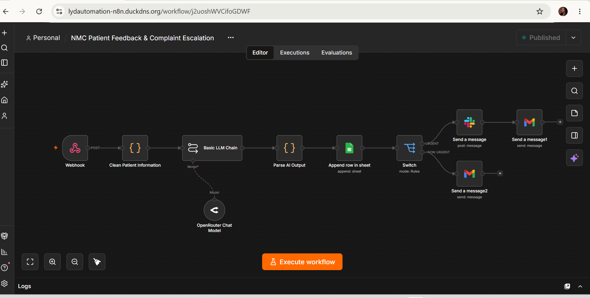
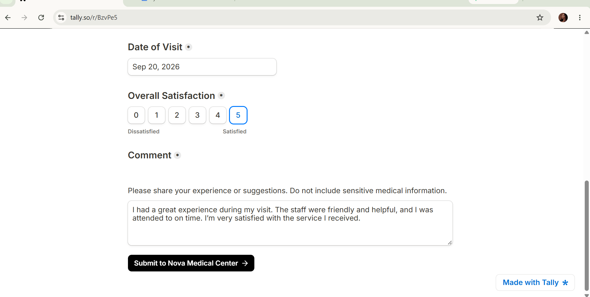
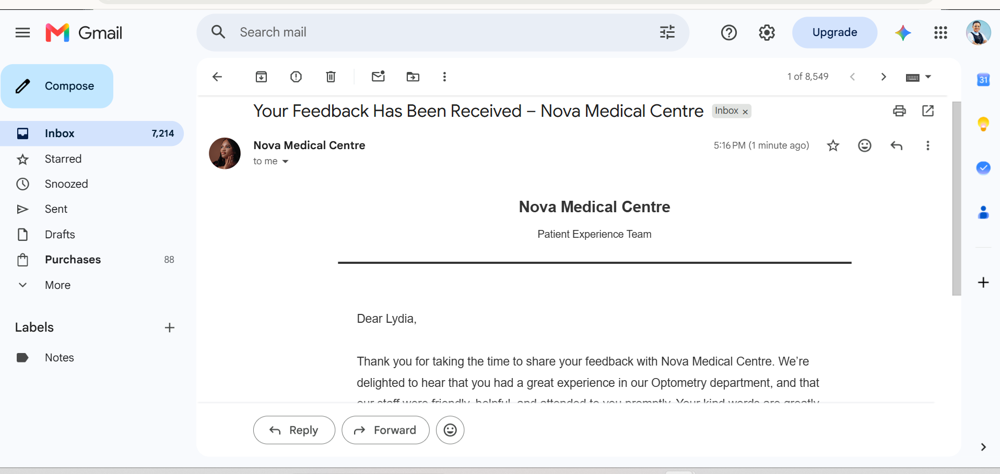
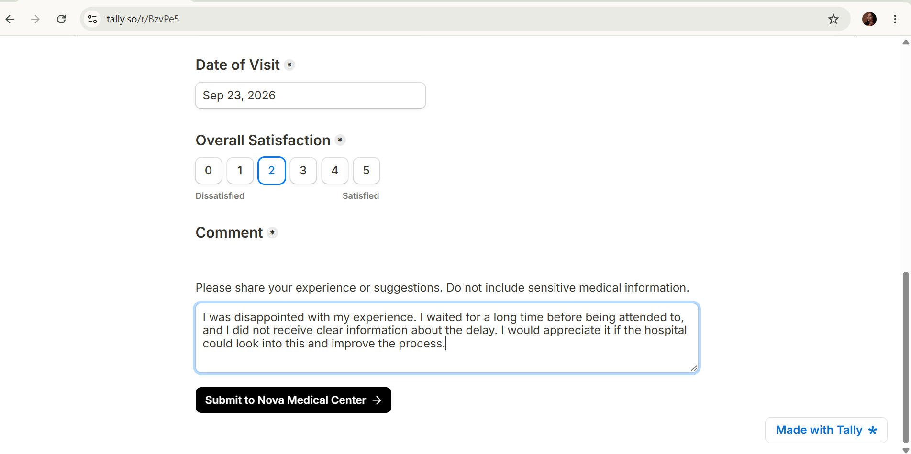
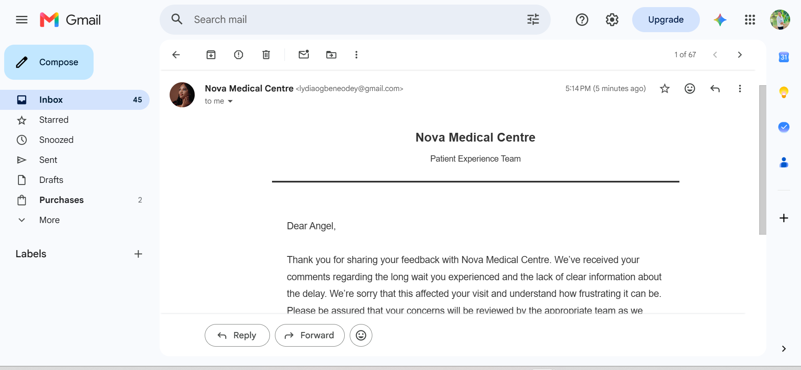
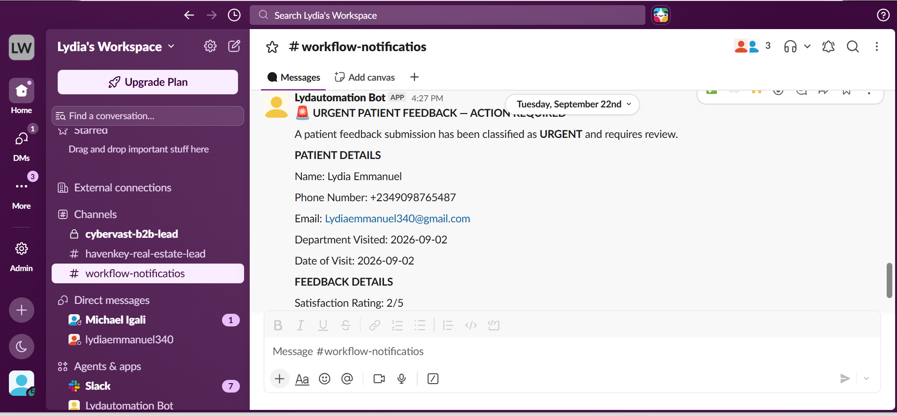
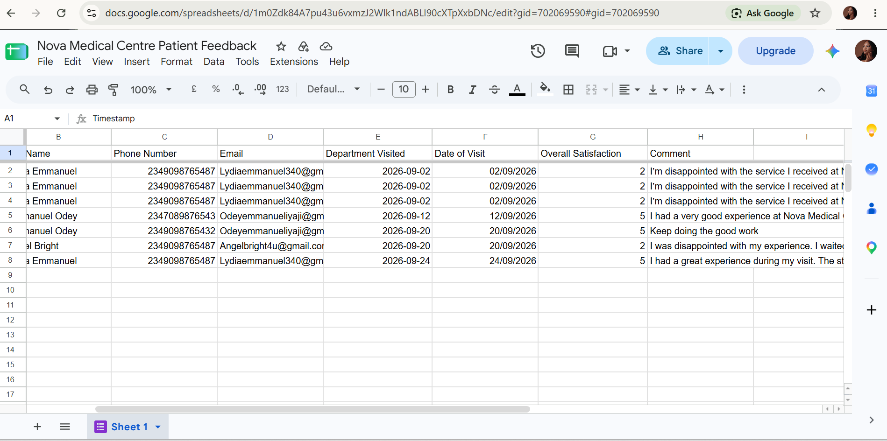

# Patient Feedback & Complaint Escalation Workflow

An AI-powered patient feedback and complaint escalation workflow designed to help healthcare organizations collect, analyze, organize, and respond to patient feedback while ensuring complaints requiring attention are escalated for human review.

## The Problem

Healthcare organizations receive different types of patient feedback.

Some patients may share positive experiences, while others may report dissatisfaction, concerns, or complaints that require attention from the appropriate team.

Manually reviewing every submission, identifying the nature of the feedback, recording it, responding to the patient, and escalating complaints can require significant administrative effort.

Important complaints may also require timely attention and appropriate human involvement.

## The Solution

This workflow automates the early stages of patient feedback management.

When a patient submits feedback, the information is captured and recorded in Google Sheets.

AI analyzes the submitted feedback and determines the appropriate route based on the nature of the patient's experience.

Positive feedback follows the positive-feedback path, while negative feedback or complaints are routed through the complaint path.

The system can automatically send an appropriate response to the patient, while complaints requiring attention are escalated to the relevant team through Slack for human review and follow-up.

## Core Capabilities

- Capture patient feedback through an online form
- Record feedback automatically in Google Sheets
- Analyze patient feedback using AI
- Route positive and negative feedback appropriately
- Send an appropriate automated email response to the patient
- Escalate complaints requiring attention through Slack
- Provide relevant feedback information to the team for review
- Maintain centralized feedback records
- Keep complaint handling and important decisions under human control

## How It Works

1. A patient submits feedback through the feedback form.
2. The workflow captures the submitted information.
3. The feedback is recorded in Google Sheets.
4. AI analyzes the patient's feedback.
5. The system routes the feedback based on the result of the analysis.
6. Positive feedback follows the positive-feedback route.
7. Negative feedback or complaints follow the complaint route.
8. The patient receives an appropriate automated email response.
9. Complaints requiring attention are escalated through Slack.
10. The healthcare team reviews escalated complaints and determines the appropriate follow-up.

## System Design

The system design shows the architecture, AI feedback analysis, positive and negative feedback routing, patient communication, complaint escalation, human review, and privacy considerations behind the Patient Feedback & Complaint Escalation Workflow.

[**View Patient Feedback System Design**](docs/patient-feedback-system-design.pdf)

## Demo

Watch the Patient Feedback & Complaint Escalation Workflow in action, from patient feedback submission and AI analysis to positive or negative routing, automated patient communication, and complaint escalation for human review.

[**Watch Patient Feedback & Complaint Escalation Demo**](https://youtu.be/ZygTYZ6hqZY?si=czBRoERfQ9RUv9aG)

## Project Screenshots

### Main Workflow Overview

The main n8n workflow manages the patient feedback process from submission and AI analysis to feedback routing, patient communication, record keeping, and complaint escalation.

### Positive Feedback Submission

A patient submits positive feedback through the feedback form.

### Positive Feedback Patient Response

After the positive feedback is processed, the patient receives an appropriate automated email response.

### Negative Feedback Submission

A patient submits negative feedback or a complaint through the feedback form.

### Negative Feedback Patient Response

After the complaint is processed, the patient receives an appropriate automated email acknowledging the feedback.

### Complaint Escalation

Complaints requiring attention are escalated through Slack, providing the relevant information to the team for human review and follow-up.

### Feedback Records

Positive and negative feedback records are stored in Google Sheets, providing a centralized record for tracking and review.

## Human-in-the-Loop Design

The workflow is designed to support patient experience processes rather than replace human judgment.

AI helps analyze and route incoming feedback, while the healthcare team remains responsible for reviewing escalated complaints, investigating concerns, making important decisions, and determining the appropriate resolution.

## Tech Stack

**Automation & Orchestration:** n8n  
**Feedback Collection:** Online Feedback Form  
**AI / LLM:** AI-powered feedback analysis  
**Feedback Records:** Google Sheets  
**Patient Communication:** Gmail  
**Complaint Escalation:** Slack

## Privacy & Data Handling

Patient feedback may contain sensitive information, so privacy and appropriate data handling are important considerations in the workflow design.

Public demonstrations and documentation for this project use fictional or test information only.

No real patient information, medical records, API keys, authentication tokens, credentials, or other sensitive information are included in the public project documentation.

---

**Built by Lydia Ogbene Odey**  
AI Automation Specialist | Health Tech Automation | Sales & CRM Automation
